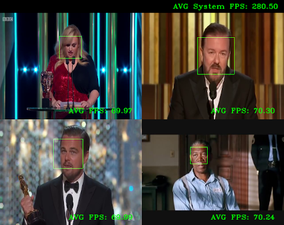
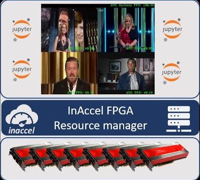

# FPGA Accelerated Face-detection

Using this repository you can test face-detection on FPGAs either On-Premise or on Cloud (on AWS F1 instances). The project is integrated with InAccel Coral, which means that the example application can be run onto a cluster of FPGAs without performing any change in the provided source code.

| Face Detection on a Single FPGA| Face Detection on a Cluster of FPGAs|
:-------------------------:|:-------------------------:
[](https://www.youtube.com/watch?v=DHIzrhyDBCI "Face Detection - Single FPGA")  |  [](https://www.youtube.com/watch?v=6Mnur6_rA9o "Face Detection - Cluster of FPGAs")

## Prerequisites

- Docker
- InAccel CLI
- InAccel Coral-API
- OpenCV libraries

You can find instructions on installing docker at https://docs.docker.com/engine/install/. Alternatively, you can install docker using the following command and further on manually configure it to start/enable the service, add your user to the docker group etc.:
``` bash
curl -sS https://get.docker.com | sh
```

For a full documentation of the InAccel stack you can refer to https://docs.inaccel.com.
To install InAccel CLI you can use the following command
```bash
curl -sS https://setup.inaccel.com/repo | sh -s install
```
Depending on your system you can either use apt or yum to install InAccel Coral API.
```bash
sudo apt/yum install coral-api
```

To install any necessary OpenCV library on Ubuntu you can simply execute the following command:
```bash
sudo apt install libopencv-*
```

For Centos and RedHat you can use the following flow for installing and configuring the OpenCV environment:
```bash
git clone https://github.com/opencv/opencv.git && cd opencv && git checkout 3.4.2 && cd ..
mkdir opencv/build && cd opencv/build && cmake .. && make -j && make install && cd ../..
ln -s /usr/local/share/OpenCV/java/libopencv_java342.so /usr/lib/libopencv_java342.so
rm -rf opencv
export LD_LIBRARY_PATH=/usr/local/lib64:$LD_LIBRARY_PATH
```


## Install a license:
After you have installed all the required packages, you need to configure InAccel. Create a free license using the following link https://inaccel.com/license/. In a few moments you will receive your license at the mail address you provided.
```bash
inaccel config license <paste-your-license-here>
```

## Start InAccel:
```bash
inaccel start
```

## Install any necessary bitstreams
To run the application on FPGAs you need the right bitstreams. To make face-detection available for Xilinx Alveo U200 install the following bitstream:
```bash
https://store.inaccel.com/artifactory/bitstreams/xilinx/u200/xdma_201830.2/edu/cornell/ece/zhang/rosetta/1.4/8face-detect
```

To use face detection on AWS please install the following bitsteam:
```bash
https://store.inaccel.com/artifactory/bitstreams/xilinx/aws-vu9p-f1/dynamic_5.0/edu/cornell/ece/zhang/rosetta/1.1/4face-detect
```

## Run the Face Detection Application
Apart from the FPGA accelerated version we also provide a CPU (reference) version of Viola Jones algorithm. The version is specified using the TARGET variable. TARGET can either be 'hw' or 'sw'.

For example, to generate the binary for the FPGA accelerated version you can issue the following command:

```bash
TARGET=hw make
```

The binary takes any input videos or cameras as arguments. E.g:

```bash
./face_detect_hw /path/to/video1 /path/to/video2 ...
```

## Resources

The Face Detection (object detection) FPGA kernel used in this repository is provided from Cornell Zhang, Rosetta GitHub repository (https://github.com/cornell-zhang/rosetta) and is tweaked to get the most out of it.

The CPU version for Viola Jones algorithm is provided from https://sites.google.com/site/5kk73gpu2012/assignment/viola-jones-face-detection.
